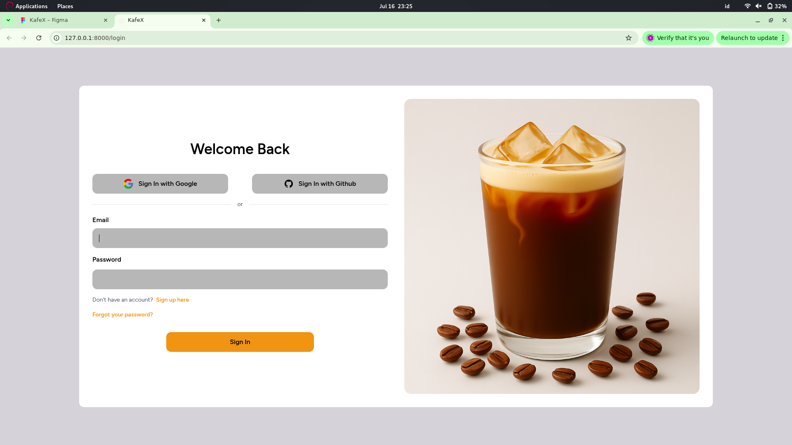
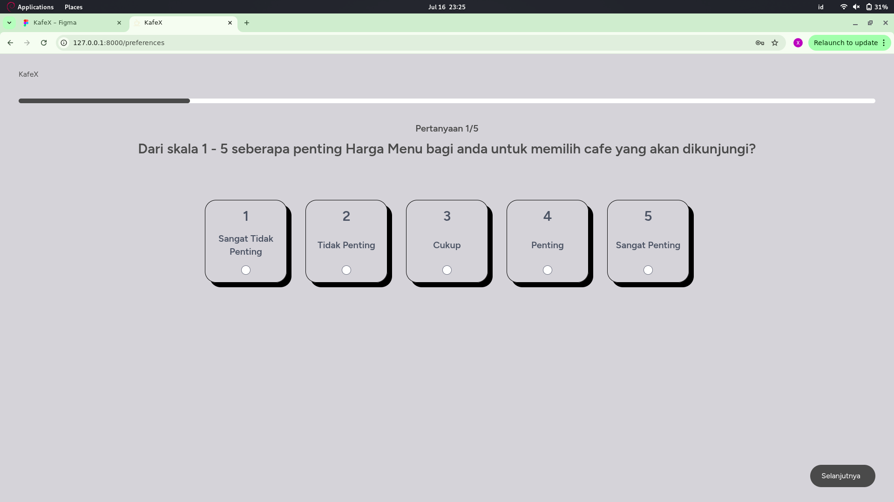
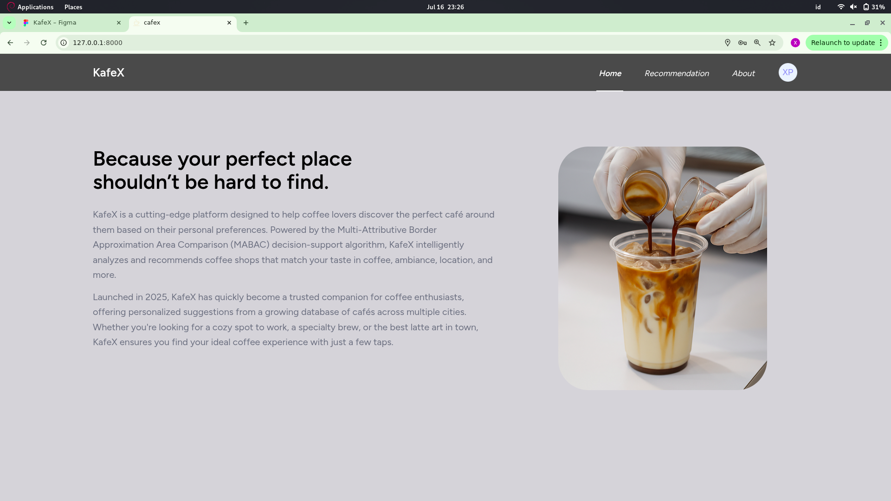
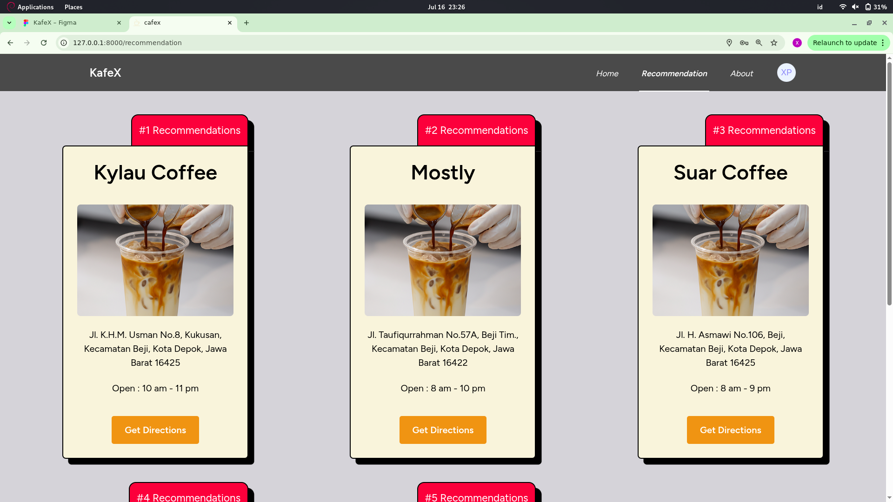
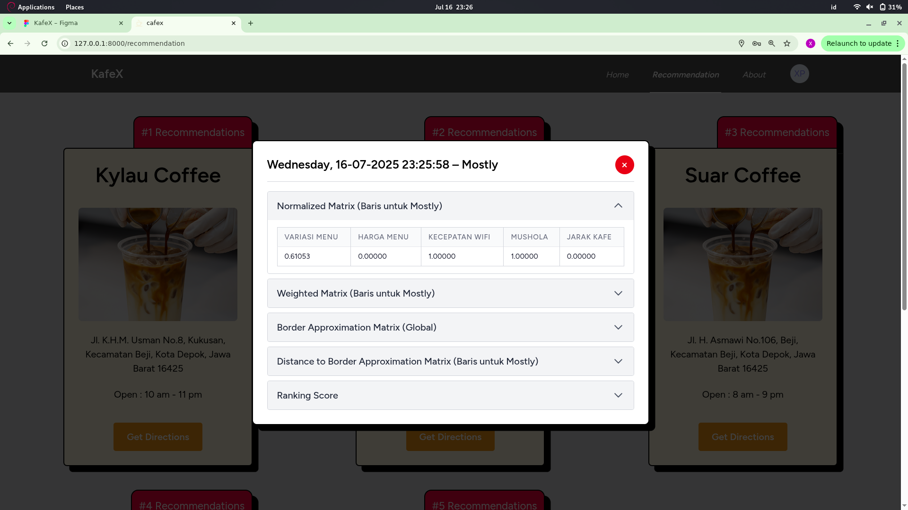
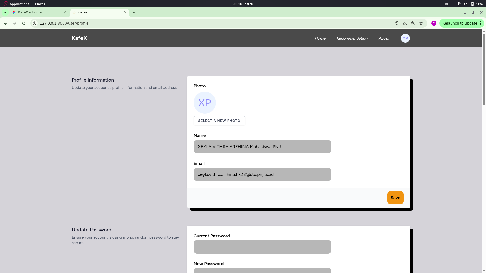

# CafeX - Cafe Recommendation System using MABAC Method (CafeX)

  

## Description
CafeX is a web-based decision support system (DSS) designed to recommend the best cafes based on user preferences using the MABAC (Multi-Attributive Border Approximation area Comparison) method.
This application allows users to answer preference-based questions, then processes them through a MABAC calculation to provide personalized cafe recommendations.

Perfect for users looking for the right cafe based on multiple criteria like price, ambiance, location, Wi-Fi quality, and more. 💻📶🍰✨

## Screenshot

<table>
  <tr>
    <td></td>
    <td></td>
    <td></td>
  </tr>
  <tr>
    <td></td>
    <td></td>
    <td></td>
  </tr>
</table>

## Features
- ✅ Dynamic questionnaire to collect user preferences
- ✅ Real-time cafe recommendation using MABAC method
- ✅ MABAC calculation result preview (Normalized Matrix, Weighted Matrix, Border Approximation, Distance, and Final Score)
- ✅ User profile and history
- ✅ Responsive UI using Tailwind CSS

## Architecture
- Laravel
- FrankenPHP
- Tailwind CSS
- MySQL

## Figma
https://www.figma.com/design/PxBeqrBpE4Vg2SYJZOOFU8/Untitled?node-id=0-1&t=958o9ypQyd8jLcUB-1